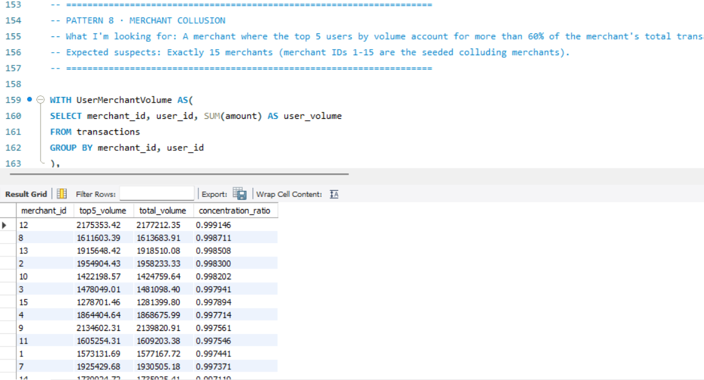

# RedFlag — Fraud Detection Engine (Pure SQL)

A fraud detection engine built entirely in MySQL for a simulated Indian payment aggregator, PayFast. Working from six months of raw transaction data (200,000 rows, 14,700+ users, 800 merchants), this project detects 12 distinct fraud patterns — from bot-driven velocity fraud and card testing to money-mule chains, merchant collusion, and account-takeover signatures — using nothing but GROUP BY/HAVING logic, correlated subqueries, and window functions like LAG() and ROW_NUMBER(). No Python, no ML libraries — just SQL doing the work fraud analytics teams at real fintechs rely on every day.

## Screenshot

Pattern 8 — Merchant Collusion: the top 5 users by volume account for 99%+ of total transaction value at several merchants, a clear money-laundering signature.



## Fraud Patterns Detected

**Tier 1 — Foundational (GROUP BY, HAVING, CASE WHEN)**
1. Velocity Fraud — 50 user-days with 30+ transactions in a single day
2. Round-Amount Clustering — 21 users with 15+ transactions in suspiciously round amounts
3. Card Testing — 20 users running 30+ sub-₹10 transactions in a single day
4. Failed-Then-Succeeded — 25 users with 20+ failed transactions followed by a matching success within 2 minutes
5. Odd-Hour Concentration — 20 users with 80%+ of activity between 2–5 AM

**Tier 2 — Joins & Subqueries (EXISTS, correlated subqueries)**
6. Mule Accounts — 30 users with 5+ credit-then-debit transfer chains within 30 minutes
7. Refund Abuse — 24 users with 20+ transactions and a refund ratio above 40%
8. Merchant Collusion — 15 merchants where the top 5 users drive over 60% of total volume
9. Just-Under-Threshold (Structuring) — 20 users with 10+ transactions at exactly ₹9,999 to dodge KYC checks
10. Dormant-Then-Active — 26 users with a 90+ day gap followed by a burst of 15+ transactions

**Tier 3 — Window Functions (LAG, ROW_NUMBER, CTEs)**
11. Velocity Spike — 66 users whose peak monthly transaction count is 5x+ their average
12. Geographic Impossibility — 15 users transacting in two different cities within 60 minutes

## Tech Stack

- **Database:** MySQL 8.x
- **Techniques:** GROUP BY / HAVING, CASE WHEN aggregates, self-joins, correlated subqueries (EXISTS), CTEs, window functions (LAG, ROW_NUMBER, PARTITION BY)
- **Dataset:** 200,000 simulated transactions, Jan–Jun 2024, across 20+ Indian cities and 4 payment modes (UPI, Card, Netbanking, Wallet)

## Repo Structure

```
├── README.md
├── RedFlag_ParvathyM.sql      # All 12 fraud detection queries
└── screenshots/                # Query output screenshots
```

> Note: The 18 MB raw dataset (`redflag_transactions.sql`) is not included in this repo due to size. Reach out if you'd like the file for reproduction.

## About

Built as part of The Unlox Academy's Minor Project series, modeled on real fraud analytics workflows used at Indian fintechs like Razorpay, Cred, Slice, and Jupiter.
